# learn unity

## References

- [https://catlikecoding.com/unity/tutorials/](https://catlikecoding.com/unity/tutorials/) (best text tutorials about 3D)
- [https://www.youtube.com/watch?v=m-J5sCRipA0](https://www.youtube.com/watch?v=m-J5sCRipA0) (import and use sprites)
- [https://www.youtube.com/watch?v=FRMy5B3dD_I](https://www.youtube.com/watch?v=FRMy5B3dD_I) (create animation and animation controller)
- [https://www.youtube.com/watch?v=zc8ac_qUXQY](https://www.youtube.com/watch?v=zc8ac_qUXQY) (switch levels and create UI)
- [https://github.com/RyanNielson/awesome-unity](https://github.com/RyanNielson/awesome-unity)
- [https://medium.com/@mik.szuga/simulating-gravity-in-unity-ae8258a80b6d](https://medium.com/@mik.szuga/simulating-gravity-in-unity-ae8258a80b6d) (simulating gravity)
- [https://www.youtube.com/watch?v=ICBP-7x7Chc](https://www.youtube.com/watch?v=ICBP-7x7Chc) (modelling in Blender beginner guide)
- [https://www.youtube.com/watch?v=Ci1jBOm_5NY](https://www.youtube.com/watch?v=Ci1jBOm_5NY) (Blender: how to cut a hole)

## Tasks

### clock

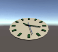

__[play online 🎮](https://kirill89.github.io/learn-unity/clock/demo)__

- game objects
- script basics

### graph

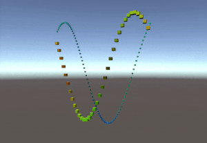

__[play online 🎮](https://kirill89.github.io/learn-unity/graph/demo)__

- create game objects dynamically (from prefabs)
- shader basics

### ball-positioning

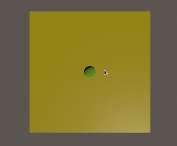

__[play online 🎮](https://kirill89.github.io/learn-unity/ball-positioning/demo)__

- user input

### physics

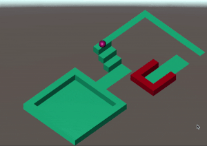

__[play online 🎮](https://kirill89.github.io/learn-unity/physics/demo)__

- collision detection
- physic basics
- isometric style

### 2d-phisics

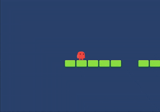

__[play online 🎮](https://kirill89.github.io/learn-unity/2d-phisics/demo)__

- 2d physic basics
- sprites animation
- script animation

### multi-scene

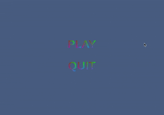

__[play online 🎮](https://kirill89.github.io/learn-unity/multi-scene/demo)__

- save/load game
- UI basics
- multiple scenes

### customize-gravity

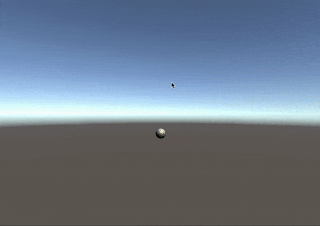

__[play online 🎮](https://kirill89.github.io/learn-unity/customize-gravity/demo)__

- get mouse click position
- apply gravity from multiple points

### gravity-golf

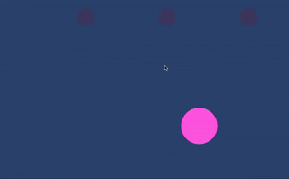

__[play online 🎮](https://kirill89.github.io/learn-unity/gravity-golf/demo)__

- basically the same as "customize-gravity" but in 2D (I though about a golf game where you can control only gravity but looks like it is a bad idea)
- precise click position detection (for 2D)
- collision ignore for specific objects
- a bit nicer gravity physics implementation

### fractal

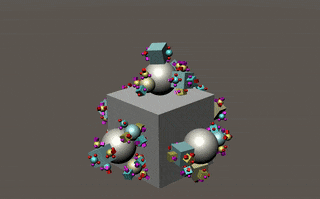

__[play online 🎮](https://kirill89.github.io/learn-unity/fractal/demo)__

- concept of mesh and material
- coroutines

### procedural-grid

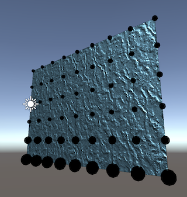

- create mesh manually
- Gizmos (debug graphics)
- concept of UV, tangents and normals

### rendering-matrices

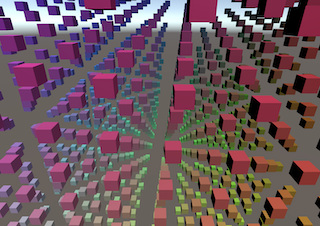

__[play online 🎮](https://kirill89.github.io/learn-unity/rendering-matrices/demo)__

- animation tricks (Mathf.PingPong, Mathf.Lerp, Transform.LookAt)
- transformation matrices

### circle-runner

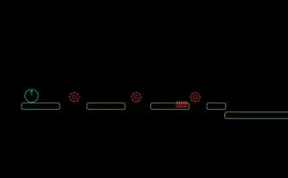

__[play online 🎮](https://kirill89.github.io/learn-unity/circle-runner/demo)__

- close to production-ready state
- design levels using ready prefabs
- sounds

### jenga

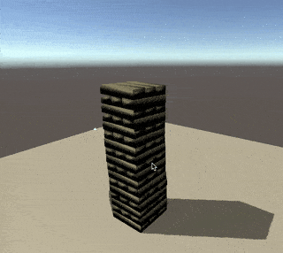

- Jenga game prototype
- blocks with small random deformation

### maze

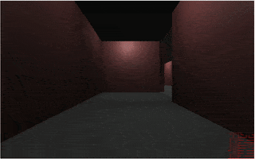

__[play online 🎮](https://kirill89.github.io/learn-unity/maze/demo)__

- randomly generated 3D maze
- first person camera
